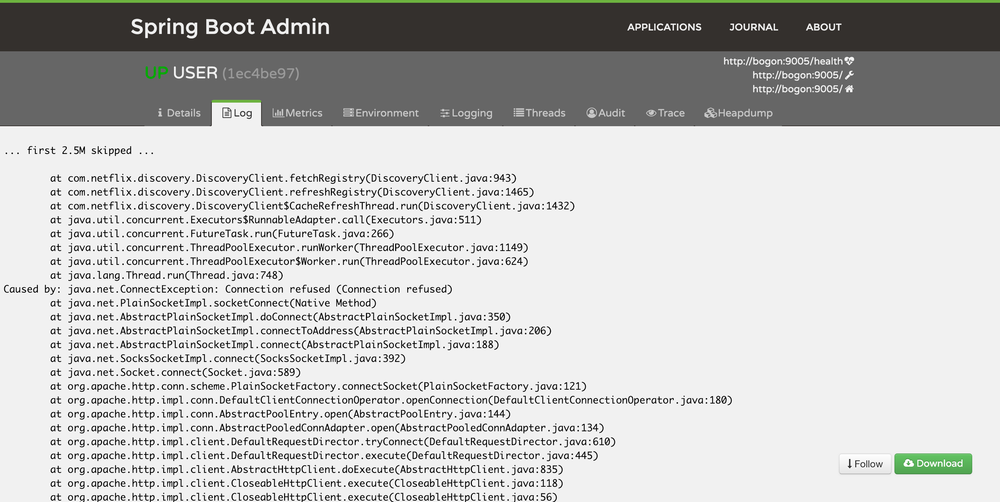
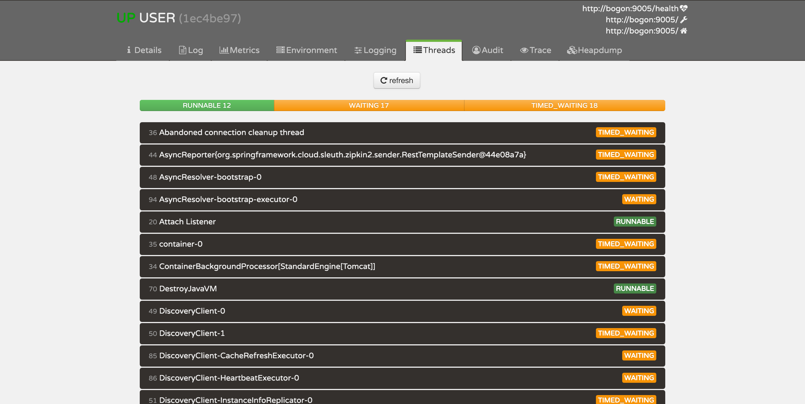

# spring-cloud-example
1、spring cloud 构建微服务架构 spring cloud + mybatis + mapstruct + lombok  
2、集成zipkin链路跟踪  
3、集成elk做日志存储和分析

## api-gateway
统一对外接口 路由所有服务
## auth
jwt权限控制
## config-server
全局环境配置服务 通过git配置所有服务配置文件
## eureka-server
注册中心 用于注册微服务
## user
用户微服务 接口、客户端、实现分离
## core
微服务全局依赖 统一异常处理等
## monitor
spring boot admin 监控中心
## zipkin
链路中心

## 配置文件修改
修改配置文件config-repo/application.yml 中的数据库配置项和logstash地址
```
eureka:
 client:
   serviceUrl:
     defaultZone: http://localhost:8761/eureka/
spring:
 datasource:
   type: com.zaxxer.hikari.HikariDataSource
   url: jdbc:mysql://localhost/dbName?useUnicode=true&characterEncoding=UTF-8&zeroDateTimeBehavior=convertToNull&useSSL=false
   username: root
   password: root
   driver-class-name: com.mysql.jdbc.Driver
 zipkin:
   base-url: http://localhost:9411
 sleuth:
   sampler:
     percentage: 1
   integration:
     enabled: false
   scheduled:
     skip-pattern: "^org.*HystrixStreamTask$"
security:
 basic:
   enabled: false
management:
 security:
   enabled: false
mybatis:
 mapper-locations: classpath*:mapper/*Mapper.xml
logstash:
 destination: 127.0.0.1:4560
logging:
 config: classpath:logback-delay.xml
 path: logs
 level:
   root: info
   
   
test:
  fresh: 6
```
### 数据库 
数据库只有一张sys_user表，user_id、user_name两个字段
```
spring:
 datasource:
   type: com.zaxxer.hikari.HikariDataSource
   url: jdbc:mysql://localhost/dbName?useUnicode=true&characterEncoding=UTF-8&zeroDateTimeBehavior=convertToNull&useSSL=false
   username: root
   password: root
   driver-class-name: com.mysql.jdbc.Driver
```
### logstash
```
logstash:
 destination: 127.0.0.1:4560
```

## 启动
最先启动这两个服务 config-server -> eureka-server -> 最后启动另外的服务

## monitor

### applications


### details


### log


### Metrics


### Environment


### Logging


### Threads


### Audit


### Trace


## 链路跟踪

### Traces


### Detail


### More


## ELK

### kibana


### 日志


### 根据链路跟踪traceId查询这次请求涉及所有服务的日志

